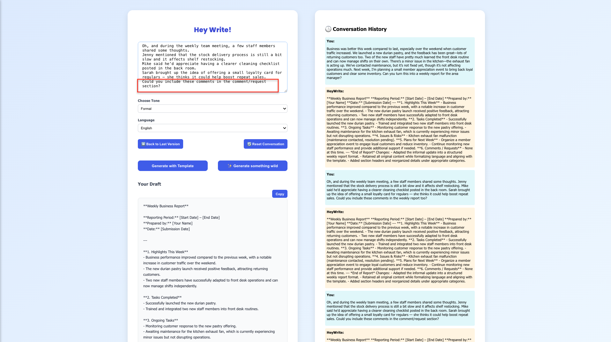

# ✨ HeyWrite - AI Smart Writing Assistant

HeyWrite is a smart AI-powered writing assistant that helps you draft professional office content based on your intent, tone, and language — all with just one sentence.

This app combines a clean React frontend with a FastAPI backend, powered by the AI generative model.

---

## Visit

https://hey-write.vercel.app/

## Features

- Generate instant writing drafts from your intent
-  Choose tone: Formal, Casual, Polite Push, Concise & Direct, Humorous, Creative
-  Support for English, Chinese, and Danish
-  React frontend (deployed to Vercel)
-  FastAPI backend (deployed to Azure App Service)
-  Environment variables for API security
-  One-click copy of generated content

---

## Tech Stack

| Frontend       | Backend      | AI Model       | Deployment     |
|----------------|--------------|----------------|----------------|
| React + CSS    | FastAPI      | DeepSeek Chat  | Vercel + Azure |

---

##  Screenshots

- Video

- Web UI

    
    
    
    
      

---

- Mobile UI

    
    
    
    

