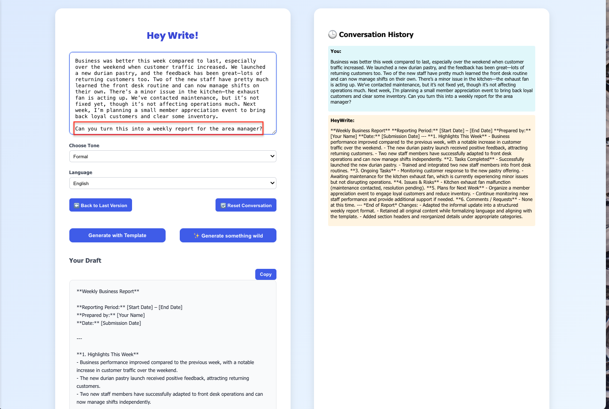
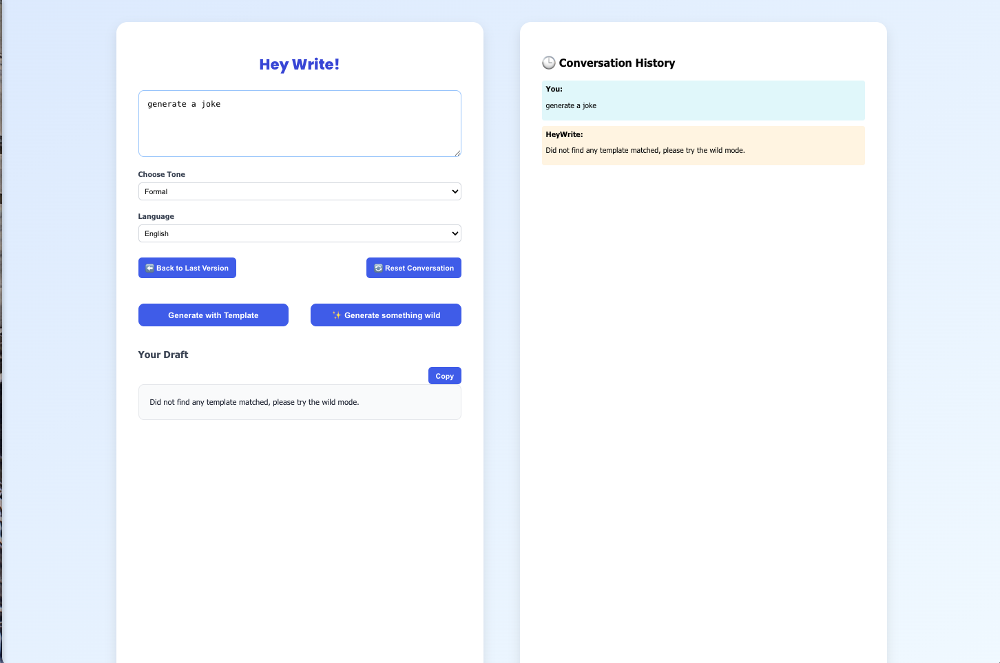
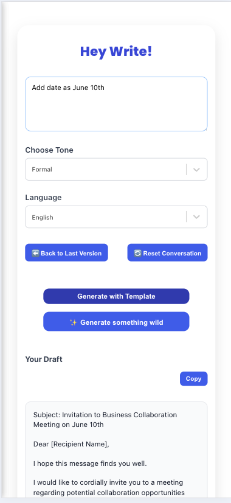

# ✨ AskMyDocs - RAG Assistant

AskMyDocs is a PDF-focused RAG assistant that only answers from your PDFs, always cites page sources, and refuses to hallucinate. Upload a PDF (current version supports one document at a time; multi-document support is planned), ask grounded questions, and summarize your document set with traceable references.

---

## 🚀 Features

- PDF upload and ingestion to Chroma (HuggingFace `intfloat/e5-small-v2` embeddings)
- RAG QA with inline page citations; refuses answers not grounded in context
- Whole-library summarization
- Conversation history and tone/language controls
- One-click copy of responses

---

## ⚙️ Tech Stack

| Category        | Technology                            |
|-----------------|---------------------------------------|
| Frontend        | React + TypeScript + Vite             |
| Backend         | FastAPI, LangChain (LCEL)             |
| Model           | LLM Chat API                     |
| Embeddings      | HuggingFace `intfloat/e5-small-v2`    |
| Vector Store    | ChromaDB                              |
| Deployment      | Backend on AWS EC2 (Docker), Frontend on Vercel |

---

## 🧭 Project Structure

```
.
├── chatbox-backend/          # Backend
│   ├── main.py               # FastAPI entrypoint
│   ├── langchain_runner/     # LangChain pipelines
│   │   ├── chains.py         # Chain assembly
│   │   ├── qa.py             # RAG QA flow
│   │   ├── summarize.py      # Library/document summaries
│   │   ├── prompts.py        # Prompt templates
│   │   └── vectorstore.py    # Chroma ingestion + retrieval
│   ├── tests/                # Backend tests
│   ├── startup.sh            # Container startup helper
│   ├── requirements.txt      # Python deps
│   └── dockerfile            # Backend container

├── chatbox-frontend/         # Frontend
│   ├── src/                  # React/Vite UI
│   │   ├── components/       # UI blocks
│   │   ├── lib/              # Client helpers (e.g., utils)
│   │   ├── assets/           # UI assets (not README screenshots)
│   │   ├── api.ts            # API client
│   │   └── App.tsx           # App shell
│   └── Dockerfile            # Frontend container
├── docker-compose.yml        # Local orchestration (frontend + backend + Chroma)
├── run_local.sh              # Helper to launch locally
```

---


## 📂 Architecture Overview

### Backend (FastAPI + LangChain)
1) PDF ingest → split + embed → Chroma vector store  
2) Query → retriever → context assembly  
3) LLM with page-citation guardrail  
4) Answer with sources or refusal  
5) Library-level summarization

### Frontend (React/Vite)
1) Upload PDFs and trigger ingestion  
2) Chat UI for RAG QA with inline citations  
3) Conversation history, tone/language controls, copy-to-clipboard  
4) API calls to backend RAG endpoints


---

### Web UI

#### demo


#### Screenshots

#### 📄 User Case: 
<div style="display: flex; gap: 10px; flex-wrap: wrap;">
    
</div>

#### 📄 Summarize: 
<div style="display: flex; gap: 10px; flex-wrap: wrap;">
    
</div>

#### 📄 Question: 
<div style="display: flex; gap: 10px; flex-wrap: wrap;">
      
</div>

#### ⚠️ No Matched Answer:
<div style="display: flex; gap: 10px; flex-wrap: wrap;">
    
</div>


---

### Mobile UI

#### demo


#### Screenshots

<div style="display: flex; gap: 10px; flex-wrap: wrap;">
    
    
</div>
